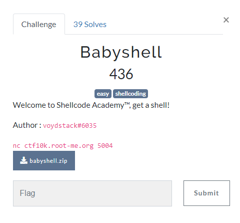

# Writeup Babyshell



## Type de fichier

Dans un premier temps nous allons regarder le type d'éxécutable.
Pour celà nous allons utiliser la commande

```bash
file babyshell

```

Cette commande nous retourne :

```bash
babyshell: ELF 64-bit LSB pie executable, x86-64, version 1 (SYSV), dynamically linked, interpreter /lib64/ld-linux-x86-64.so.2, BuildI [sha1=47259a1a89a34381f559a6b7d64769c3431faa9e, for GNU/Linux 3.2.0, not stripped
```

Nous savons donc que notre éxécutable est en x86-64 pour linux.

Il nous reste donc à trouver le shellcode.

## Shellcode

Pour celà nous allons chercher dans une base de donnée de shellcode : <https://shell-storm.org/shellcode/index.html> en sachant que nous voulons un reverse shell.

Le shellcode est donc : <http://shell-storm.org/shellcode/files/shellcode-806.html>
